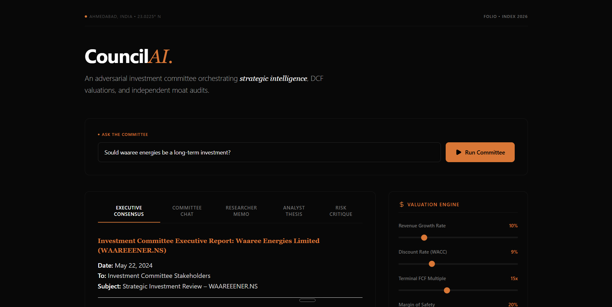
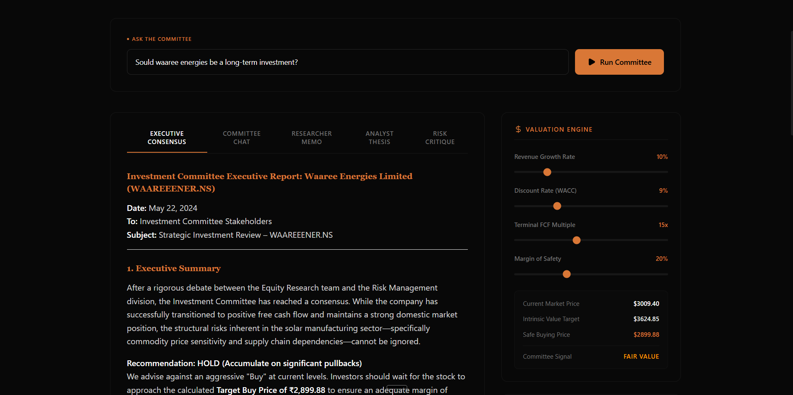
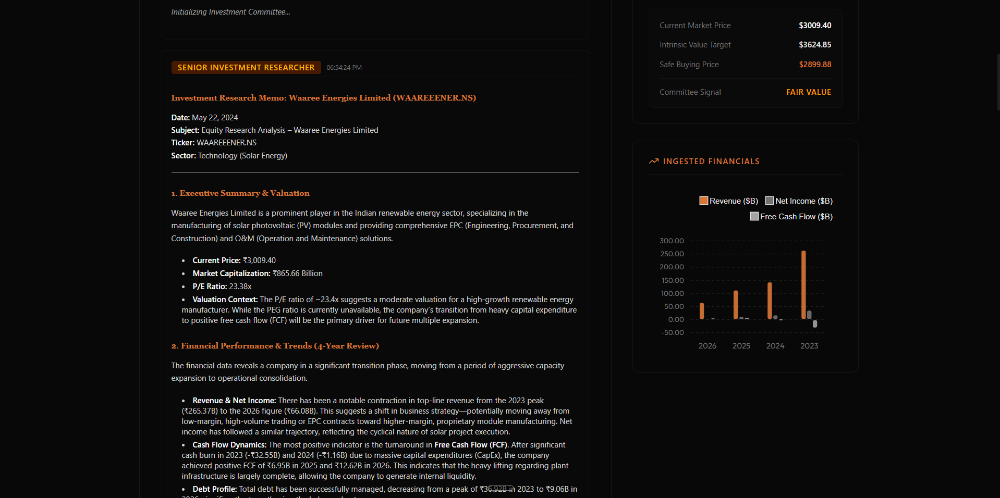

# CouncilAI — Agentic Investment Research Committee

CouncilAI is a multi-agent equity analysis platform built with **FastAPI** (Python) and **React JS** (Vite + Tailwind CSS). It orchestrates a consensus-driven committee of specialized agents using **LangGraph** to perform real-time financial Ingestion, deterministic Discounted Cash Flow (DCF) modeling, qualitative risk audits, and synthesis reporting.

## System Architecture
The platform connects a modern React frontend with a Python-based agentic backend, orchestrating specialized financial tools. The execution state flows through a compiled Directed Acyclic Graph (DAG) in LangGraph, pushing real-time node updates to the user over a WebSocket connection.

## Key Features
* **Natural Language Interface**: "Should I buy NVIDIA stock?" or "Would Waaree Energies be a good long-term investment?"
* **Autonomous Reasoning**: The agent extracts the ticker, estimates growth/WACC assumptions dynamically, performs balance sheet audits, and reconciles opposing viewpoints.
* **Deterministic Financial Grounding**: Leverages local Python calculators for Discounted Cash Flow (DCF) valuations to prevent LLM math hallucinations.
* **Integrated Financial Tools**:
  * **yfinance**: Ingests actual active balance sheets, income statements, and market metadata.
  * **DuckDuckGo Search**: Gathers recent sentiment, market news, and qualitative research.
* **Adversarial Audit**: A specialized Moat & Risk Critic challenges the Analyst's assumptions, evaluating custom ASICs, supply-chain bottlenecks (TSMC/CoWoS), and grid power limits.
* **Human-in-the-Loop Recalculation**: Live draggable UI sliders allow the user to modify DCF assumptions and trigger instant backend calculations without re-running the agent committee.

## UI Preview

### 1. Multi-Agent Consensus Dashboard


### 2. Interactive Executive Consensus Report


### 3. Real-Time Financial Ingestion & Analysis


## Repository Structure
| Directory | Purpose |
| :--- | :--- |
| `/backend/app/agents` | Specialized agent node logic (Researcher, Analyst, Critic, Reporter). |
| `/backend/app/graph` | LangGraph workflow compiler and shared state schema. |
| `/backend/app/tools` | Programmatic financial calculation engine and web search tools. |
| `/frontend/src` | React UI dashboard, dynamic ApexCharts visualizations, and chat interface. |

## Getting Started
This is a monorepo. You will need to set up both the backend and frontend.

### 1. Backend Setup
Go to the `backend/` directory, set up your environment variables, and install dependencies:

```bash
cd backend
# Create and activate your virtual environment, then install dependencies:
pip install -r requirements.txt
```
Create a `backend/.env` file with your API key:
```env
GEMINI_API_KEY=your_gemini_api_key_here
```
Start the FastAPI server:
```bash
python server.py
```

### 2. Frontend Setup
Go to the `frontend/` directory, install dependencies, and start the development server:

```bash
cd frontend
npm install
npm run dev
```

## License
MIT License.
